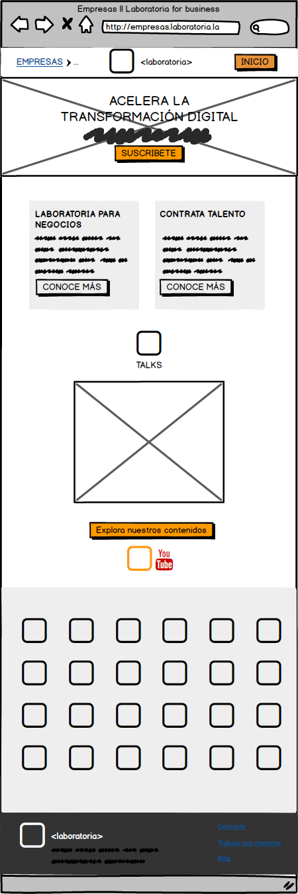

# OPTIMIZACIÓN LABORATORIA

* **Track:** _UX Specialization_
* **Sprint 05:** _UX PROCESS_

## OBJETIVO:

** Seleccionar una de las vistas de la página de Laboratoria y optimizarla utilizando lo aprendido en las clases de arquitectura de la información y diseño de interactividad **

### EQUIPO

  ** Tania Sosa **
    *UX Researcher*

  ** Karina Quesada **
    *UX Researcher*

  ** Jazmin López **
    *UX Researcher*

  ** Carmen Vega **
    *UX Designer*

  ** Adriana Dillarza **
    *UX Designer*

  ** Elzbeth Blanco **
    *Product Owner*

### PROCESO

  - #### INSPECCIÓN DE LA PÁGINA OFICIAL DE LABORATORIA
  - #### SELECCIÓN DE UNA VISTA Y ANÁLISIS DE * HEURÍSTICA:AS
  - #### ELABORACIÓN DE MAPA DEL SITIO
  - #### WIREFRAME DE PROPUESTA DE OPTIMIZACIÓN
  - #### MOCKUP DE PROPUESTA DE OPTIMIZACIÓN
  - #### ELABORACIÓN DE MAPA DE INTERACTIVIDAD

___________________________________________________________________________________________________________________

### INSPECCIÓN DE LA PÁGINA OFICIAL DE LABORATORIA

___________________________________________________________________________________________________________________

### SELECCIÓN DE UNA VISTA Y ANÁLISIS DE HEURÍSTICAS

* #### HEURÍSTICA: VISIBILIDAD DEL ESTADO DEL SISTEMA

  ##### SEVERIDAD: 2

  ** NOTAS: **
    El botón EMPRESAS presenta información reiterativa al estar posicionado en la vista Empresas. Confunde al usuario.

    ** RECOMENDACIÓN: **
    Suprimirlo, o mostrar en donde está posicionado el usuario por medio de breadcrumbs.
 
* #### HEURÍSTICA: CONSISTENCIA Y ESTÁNDARES

  ##### SEVERIDAD: 1

 ** NOTAS: **
    Sería de utilidad posicionar estas secciones en el lado correspondiente a estudiantes o empresas, en el caso de que el botón empresas siga en esta vista.
    No hay consistencia entre los elementos Estudiantes vs Empresas.

    ** RECOMENDACIÓN: **
    Cambiar las posiciones, Corporate hacia la derecha y Contrata hacia la izquierda.
 
* #### HEURÍSTICA: ESTÉTICA Y DISEÑO MINIMALISTA
  ##### SEVERIDAD: 0
 
  ** NOTAS: **
  Sería bueno encontrar el video informativo de los contenidos con empresas antes del contenedor de logos de empresas, aporta información relevante. La sección de logos da la impresión de que la página finalizó.

  ** RECOMENDACIÓN: **
  Cambiar la posición de elementos, videos en primera instancia y logos en segunda.
 
* #### HEURÍSTICA: CONSISTENCIA Y ESTÁNDARES
  #### SEVERIDAD: 1
  
  ** NOTAS: **
  Ambos botones redireccionan al mismo sitio en youtube, es información repetiva.

  ** RECOMENDACIÓN: **
  Suprimir alguno de los botones, o que el boton amarillo de laboratoria contenga al de youtube.
 
* #### HEURÍSTICA: CONSISTENCIA Y ESTÁNDARES
  SEVERIDAD: 3
 
 ** NOTAS: **
  El botón no redirecciona a la suscripción, y en caso de realizarla, no da retroalimentación oportuna al usuario.

 ** RECOMENDACIÓN: **
  Redireccionar al formulario de sucripción o enviar una confirmación de suscrpción.

___________________________________________________________________________________________________________________

### ELABORACIÓN DE MAPA DEL SITIO

___________________________________________________________________________________________________________________

### WIREFRAME DE PROPUESTA DE OPTIMIZACIÓN

___________________________________________________________________________________________________________________

### MOCKUP DE PROPUESTA DE OPTIMIZACIÓN

___________________________________________________________________________________________________________________

### ELABORACIÓN DE MAPA DE INTERACTIVIDAD DE LA VISTA PROPUESTA

___________________________________________________________________________________________________________________

### CONCLUSIONES

El sitio de Laboratoria no presenta grandes errores de usabilidad o interacción, sin embargo se puede mejorar mediante la optimización de pequeños detalles que mejorarán la experiencia de los usuarios.

# ARQUITECTURA DE LA INFORMACIÓN
** LABORATORIA 2018 **

-------------------------------------------------------
